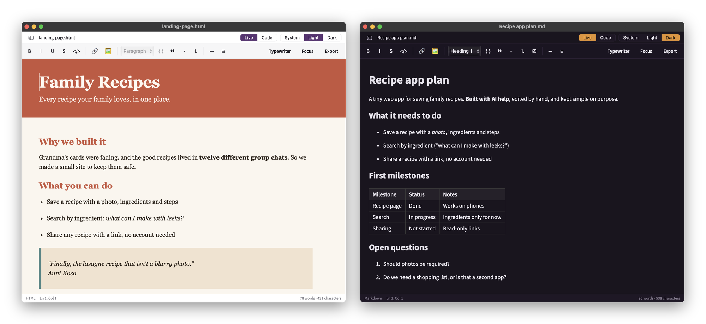

# Edtr

**A simple Mac app for editing the Markdown and HTML files your AI tools make, yourself, without learning either.**



AI tools are great at making things. They write the plans, notes and `README.md` files that come with your projects, and they build whole web pages: landing pages, reports, one-pagers. But when you want to fix one word, you are stuck. Open the file and it is a wall of symbols and code. Ask the AI instead, and you are prompting for a typo fix and hoping it does not rewrite anything else.

Edtr lets you just open the file and edit it. It shows **Markdown** files and **HTML** web pages the way they are meant to look, and you edit them like a document: click, type, and use the toolbar for bold, headings, lists, links, tables and pictures.

**[Download Edtr for Mac](https://github.com/andyg-xd/edtr/releases/latest)** · macOS 13 (Ventura) or later · Apple silicon and Intel

## Two kinds of file, one simple editor

**Web pages (HTML).** HTML is the language web pages are written in. When an AI tool builds you a page, it hands you an `.html` file full of tags like `<h1>` and `<p>`, usually with its own design built in. Edtr opens that page looking the way it does in a browser, with its own colours, fonts and layout, and lets you change the words directly. Fix a headline, rewrite a paragraph, add a bullet point, bold a phrase, save. The page's design and code stay exactly as they were.

**Documents (Markdown).** Markdown is a way of writing formatted text with ordinary characters: a line starting with `#` becomes a heading, words wrapped in `**` become **bold**, and lines starting with `-` become a list. AI tools and code projects use it everywhere (`README.md`, `CLAUDE.md`, `AGENTS.md`, plans, specs) because any program can read it. Edtr shows those files as clean, readable documents and lets you edit them without typing a single `#`.

## Two ways to see and edit the same file

This is the heart of Edtr. Every file has two views, and **you can edit in both**. The **Live** and **Code** switch at the top right flips between them at any time, and your changes carry across.

- **Live** shows the file formatted: a web page as it looks in a browser, a Markdown file as a clean document. Click anywhere and type. The toolbar handles bold, italic, links, headings, lists, quotes, tables and pictures, and adjusts to the kind of file you have open. You never touch a tag or a symbol.
- **Code** shows the raw text with every tag and symbol, for when you want to see or change exactly what is in the file.

Most tools give you one or the other: a preview you can only look at, or raw code you have to decode. Edtr gives you both, both editable, one click apart.

## The one promise

**Edtr only changes what you change.**

Many editors quietly "tidy up" a file when they save it: they re-wrap lines, re-indent code, reorder things or re-space a table you never touched. In a web page that can break the design. In a project folder it turns a one-word edit into a wall of changes nobody asked for.

Edtr does not do that. When you save, only the part you actually edited is rewritten. Everything else stays exactly as it was, character for character. On a web page, that includes the page's design (its CSS, the code that controls how it looks), its scripts and every setting on every tag. This is enforced by automated tests that run on every change, not left to good intentions.

## Install

1. [Download the latest version](https://github.com/andyg-xd/edtr/releases/latest). It is the file ending in `.dmg`.
2. Open it and drag **Edtr** into your **Applications** folder.
3. Open Edtr from Applications.

Edtr is signed and checked by Apple, so it opens normally with no security warnings.

## A quick tour

- **Opening files.** Besides ⌘O, you can drag a file onto the window or the Dock icon, or right-click it in Finder and choose **Open With → Edtr**. Edtr opens web pages (`.html`, `.htm`), Markdown (`.md`, `.markdown`) and plain text, and can open a whole folder at once.
- **Web pages stay safe to open.** In Live view a page's scripts (the code behind buttons and animations) are switched off, so nothing runs on your Mac. They stay in the file and work as normal in a browser. A page that builds most of its content with code as it loads will show less in Live view; use Code view for those.
- **Links.** Hover over a link to see where it goes at the bottom of the window. ⌘-click it to open it. A plain click just puts the cursor there, so you can edit the link's text.
- **Tables.** Click into a table to edit a cell. A small toolbar appears for adding and removing rows and columns and setting alignment.
- **Pictures.** Insert them with the toolbar, by dragging them in, or by pasting. Edtr copies each picture into a folder next to your file, so they stay together.
- **Find and replace.** Match upper and lower case exactly, match whole words only, or keep each match's capitalisation when replacing.
- **If the file changes somewhere else.** If an AI tool or another app edits the file while it is open, Edtr offers to reload it, and never throws away your unsaved work to do so.
- **Outline.** The button at the far left of the window lists the file's headings. Click one to jump to it.
- **Writing modes.** **Focus** fades everything except the paragraph you are on. **Typewriter** keeps the line you are typing near the middle of the window.
- **Export.** Turn what you have open into a single web page you can send to anyone, pictures included, or save it as a PDF.
- **Light and dark.** Pick **System**, **Light** or **Dark** at the top right. The word and character count sits at the bottom right.

### Keyboard shortcuts

| Shortcut | What it does |
|---|---|
| ⌘O | Open a file |
| ⇧⌘O | Open a folder |
| ⌘S | Save |
| ⇧⌘S | Save a copy under a new name |
| ⌘W | Close the window (Edtr asks first if there are unsaved changes) |
| ⌘B | Bold |
| ⌘I | Italic |
| ⌘U | Underline (web pages only) |
| ⌘K | Add a link |
| ⌘-click a link | Open it: web links in your browser, links to other files in a new Edtr window |
| ⌘F | Find |
| ⌥⌘F | Find and replace |
| ⌘G | Next match |
| ⇧⌘G | Previous match |
| Esc | Close find |
| ⌘P | Print, or save as a PDF |
| ⌘Q | Quit |

## What Edtr is not

Edtr does one job: reading and editing Markdown documents and web pages. It is deliberately not a code editor or a website builder. There is no file tree for a whole project, no plugins, no terminal and no built-in Git, and it will not change a page's layout or design for you. If you need those, keep using your code editor or your AI tool, and open Edtr alongside them when you want to change the words yourself.

## Questions

**Is it free?** Yes. Edtr is free and open source.

**Does it work on Windows or Linux?** No, only on Macs running macOS 13 or later.

**Can I change a web page's design, like its colours or layout?** Not in Live view, which is for the words and their formatting. The design lives in the page's code, and you can edit that directly in Code view if you want to.

**Will it mess up files my AI tools also edit?** No. That is the point of the promise above: Edtr rewrites only what you changed, so it plays nicely with other tools editing the same files.

**Does it send my files anywhere?** No. Your files never leave your Mac, and Edtr has no accounts, sign-in or tracking. (A web page you open may still load its own fonts or pictures from the internet, the same way it would in a browser.)

**I found a bug or have an idea.** Please [open an issue](https://github.com/andyg-xd/edtr/issues) and say what you did, what you expected, and what happened instead.

## Licence

Edtr is free software under the [GNU General Public License, version 3 or later](LICENSE). You can use it, study it, change it and share it. If you share a changed version, it has to stay under the same licence.

---

## Building from source

Everything below is for developers who want to build Edtr themselves or cut a release. You do not need any of it to use the app.

Edtr is built with [Tauri 2](https://tauri.app) (a Rust shell around the Mac's own web view), React, TypeScript, [CodeMirror 6](https://codemirror.net) for Code view and [ProseMirror](https://prosemirror.net) for Live view.

### Requirements

- macOS 13 (Ventura) or later
- Node.js 18+
- Rust (stable) with `~/.cargo/bin` on your `PATH`

For a universal build that runs on both Apple silicon and Intel, add the Intel target once:

```sh
rustup target add x86_64-apple-darwin
```

### Develop

```sh
npm install
npm run tauri dev
```

### Test

```sh
npm test        # frontend
npm run lint    # frontend lint
cd src-tauri && cargo test
```

### Build

An unsigned build, for local use only:

```sh
npm run tauri build
```

### Build a signed, notarized release

This produces the file other people install. It signs the app with a Developer ID certificate,
sends it to Apple for notarization, and staples the result so it opens without warnings even on
a machine that is offline.

You need a paid Apple Developer account, and the Developer ID Application certificate must be
in the keychain of the machine you build on.

**1. Find your signing identity.**

```sh
security find-identity -v -p codesigning
```

Copy the full name in quotes, which looks like
`Developer ID Application: Your Name (ABCDE12345)`.

**2. Create an app-specific password.** Sign in at
[appleid.apple.com](https://appleid.apple.com) and go to Sign-In and Security, then
App-Specific Passwords. This is not your Apple ID password. Your team identifier is the ten
character code shown on the Membership page of your developer account, and it is the same code
that appears in the identity above.

**3. Set the environment, then run the release.**

```sh
export APPLE_SIGNING_IDENTITY="Developer ID Application: Your Name (ABCDE12345)"
export APPLE_ID="you@example.com"
export APPLE_PASSWORD="abcd-efgh-ijkl-mnop"
export APPLE_TEAM_ID="ABCDE12345"

npm run release
```

Nothing here is written to disk or committed. Set the variables in the shell you build from.

`npm run release` is the whole procedure: it checks the identity is in your keychain and the
tree is clean before spending twenty minutes on a build, installs from the lockfile with
`npm ci` so the gate is a statement about the repository rather than about your `node_modules`,
runs typecheck, tests, lint and `cargo check`, builds and signs, **staples the disk image**, and
verifies the finished artifact. It is safe to re-run; an image that already carries a ticket is
not resubmitted.

Steps 3a to 4 below describe what it does, and are what to run if you ever need to drive the
process by hand. The commands use `$DMG` for the disk image, whose name carries the version:

```sh
DMG=$(ls src-tauri/target/universal-apple-darwin/release/bundle/dmg/Edtr_*_universal.dmg)
```

**3a. The build itself.**

```sh
npm run build:release
```

That command signs the app, sends it to Apple, and staples the result to the app. Notarization
takes anywhere from two minutes to about an hour, depending on how busy Apple's queue is. A long
wait is not a sign of failure. To check on it from another shell:

```sh
xcrun notarytool history --apple-id "$APPLE_ID" --password "$APPLE_PASSWORD" --team-id "$APPLE_TEAM_ID"
```

**3b. Staple the disk image. This step is required and the build does not do it.**

`npm run release` does this for you. It is written out here because the build reports success
without it, so anyone driving the process by hand will otherwise ship an image with no ticket.

The build staples the app but not the DMG that carries it, so the disk image is left without a
ticket. The app inside still works, but someone who mounts the image while offline can be told
it cannot be verified. Submit the image on its own and staple it:

```sh
xcrun notarytool submit "$DMG" --apple-id "$APPLE_ID" --password "$APPLE_PASSWORD" --team-id "$APPLE_TEAM_ID" --wait
xcrun stapler staple "$DMG"
```

Do not skip this because the build reported success. It reports success either way. Step 4
fails if you forget.

**4. Check the result.**

```sh
npm run verify:release
```

This mounts the DMG and checks the app inside it, which is the copy a recipient actually
receives rather than the one left in the build directory. It verifies the signature, confirms
Apple's notarization was applied, confirms the notarization ticket is stapled to both the app
and the DMG, and confirms the hardened runtime and team identifier are really present rather
than merely configured. It exits non-zero if any of that is untrue.

The check that matters most is `spctl`, which must report **accepted**. Anything else means
notarization did not take, and the people you send the file to will be told the app cannot be
opened.

This script exists because the Rust tests in `src-tauri/src/distribution.rs` can only check the
configuration. They cannot see the built artifact, so none of them would catch a toolchain
upgrade that quietly stopped signing. That has happened here before: an ad-hoc signature shipped
unnoticed for a month.

To run the same checks by hand:

```sh
hdiutil attach "$DMG"
codesign --verify --deep --strict --verbose=2 /Volumes/Edtr/Edtr.app
spctl -a -t exec -vv /Volumes/Edtr/Edtr.app
xcrun stapler validate /Volumes/Edtr/Edtr.app
xcrun stapler validate "$DMG"
hdiutil detach /Volumes/Edtr
```

The finished artifacts are:

```
src-tauri/target/universal-apple-darwin/release/bundle/macos/Edtr.app
src-tauri/target/universal-apple-darwin/release/bundle/dmg/Edtr_<version>_universal.dmg
```

#### If notarization is rejected

The rejection log names exactly what is wrong. Read it before changing anything:

```sh
xcrun notarytool log <submission-id> --apple-id "$APPLE_ID" --password "$APPLE_PASSWORD" --team-id "$APPLE_TEAM_ID"
```

Edtr ships with no entitlements file, because it does its file work in Rust and is not
sandboxed. If the log asks for an entitlement, add it then, and write down why.
